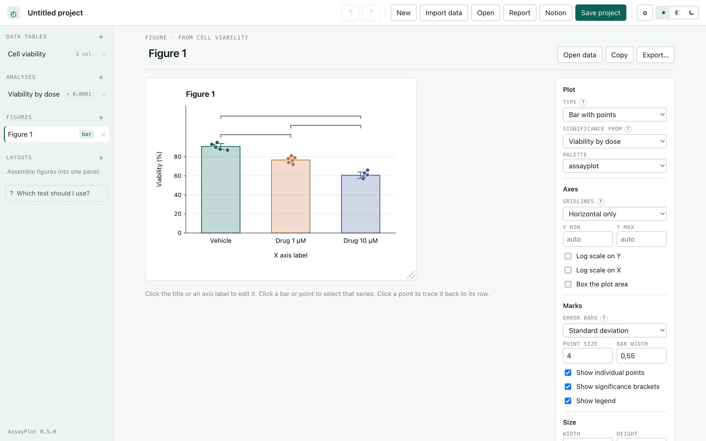
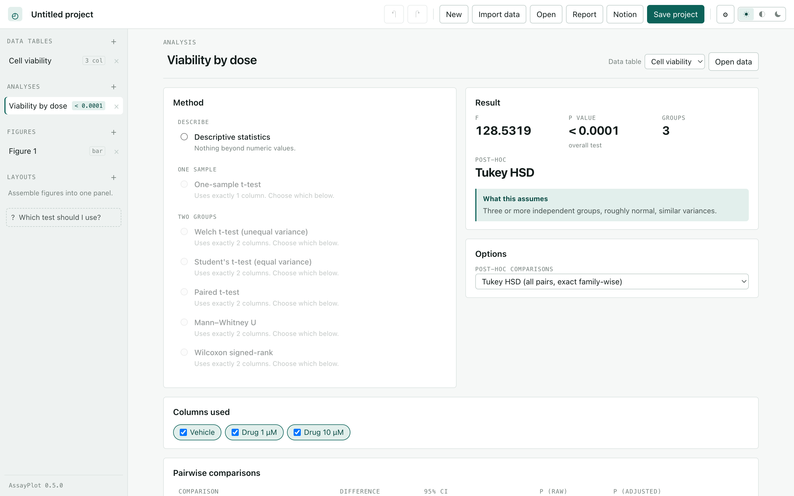

<div align="center">


# AssayPlot

**Free, open-source statistics and publication figures for the lab.**
For people who would rather not write code.

[](https://github.com/FarisHrvat/assayplot/releases/latest)
[](docs/VALIDATION.md)
[](docs/VALIDATION.md)
[](LICENSE)
[](#download)

[**Download**](#download) · [User guide](docs/GUIDE.md) · [How the statistics are validated](docs/VALIDATION.md) · [Roadmap](docs/ROADMAP.md)

</div>

<br>



It runs on your machine. There is no account, no cloud, no subscription, and no
telemetry. Your data does not leave the computer.

---

## Download

Grab the build for your machine, open it, and start. Nothing else to install.
After that it tells you when a new version is out and offers to fetch it.

| Your machine | File |
|---|---|
| Mac, Apple Silicon (M1 and later) | `AssayPlot_x.y.z_aarch64.dmg` |
| Mac, Intel | `AssayPlot_x.y.z_x64.dmg` |
| Windows | `AssayPlot_x.y.z_x64-setup.exe` |
| Linux, Debian or Ubuntu | `AssayPlot_x.y.z_amd64.deb` |
| Linux, anything else | `AssayPlot_x.y.z_amd64.AppImage` |

**[→ Latest release](https://github.com/FarisHrvat/assayplot/releases/latest)**

Builds are not yet signed, so your system will object the first time:

- **macOS** — right-click the app, choose Open, then Open again. Or
  `xattr -dr com.apple.quarantine /Applications/AssayPlot.app`.
- **Windows** — SmartScreen says "Windows protected your PC". Choose More info,
  then Run anyway.
- **Linux** — `chmod +x` the AppImage, or install the `.deb`.

Open one of the projects in [`examples/`](examples) to see a finished analysis.

---

## What it does

### Get your data in

Four table shapes, so the layout matches how the experiment was recorded:
**Column** for comparing groups, **Grouped** for two factors, **XY** for
anything against a concentration or a time, and **Survival** for time-to-event.

Reads `.csv`, `.tsv`, `.txt`, `.xlsx`, `.xls` and `.ods`, several files at once,
and you can paste a block straight out of Excel. The delimiter and the decimal
separator are detected, so a file written in Italy and a file written in the
United States both come in correctly — `1,5` stays one and a half. The grid
navigates with the arrow keys and handles 100,000 rows.

### Run a defensible analysis



**43 analyses.** Methods that cannot run on the current table are greyed out
*with the reason*, and every one states what it assumes before you commit to it.

| | |
|---|---|
| Describe | Descriptive statistics |
| One sample | One-sample *t*-test |
| Two groups | Welch, Student, paired *t*-test, Mann–Whitney, Wilcoxon signed-rank |
| Three or more | One-way ANOVA, Kruskal–Wallis, Friedman |
| Two factors | Two-way ANOVA with replication |
| X versus Y | Pearson, Spearman, linear regression, dose–response with intervals |
| Survival | Kaplan–Meier with log-rank |
| Counts | Chi-square with Yates, Fisher's exact, McNemar |
| Modelling | Logistic, Poisson, ANCOVA, mixed effects, GEE, Cox proportional hazards |
| Multivariate | Principal components, hierarchical clustering with bootstrap, ANOSIM, PLS-DA |
| Agreement | Cohen's kappa, Bland–Altman, TOST equivalence |
| Meta-analysis | Cochran's *Q* and *I*², Mantel–Haenszel |
| Genetics | Transmission disequilibrium, Mendelian randomisation |
| Study design | Simon's two-stage, resource equation |
| Assumptions | Shapiro–Wilk, D'Agostino–Pearson, Levene, Bartlett, Grubbs, ROUT |

Post-hoc comparisons are done properly: Tukey HSD with real family-wise
confidence intervals, Dunn's test after Kruskal–Wallis, each group against a
control, or Holm and Benjamini–Hochberg on plain pairwise tests.

### Build the figure

**37 plot types** — bar, dot, box, violin, strip, beeswarm, mean with error,
lollipop, before/after lines, histogram, density, ECDF, Q–Q, scatter, line,
area, step, bubble, heatmap, correlation matrix, pie, donut, Kaplan–Meier,
Bland–Altman, forest, fitted probability curve, ROC, parallel lines by group,
hazard ratios, PCA scores with loadings, scree, dendrogram with bootstrap
support, clustered heatmap, PLS-DA scores, ANOSIM rank dissimilarities,
Mendelian randomisation scatter, and flagged outliers.

**You edit a figure by clicking it.** Click the title or an axis label and type
over it; click a bar or a curve to select that series and change its colour.
Gridlines, log axes, error-bar definition, significance brackets and exact
dimensions are all under your control. Drag the corner to resize. Panels
assemble into multi-panel figures with A/B/C labelling.

Export as SVG with live text, PNG at the resolution you choose, or PDF — and
every export asks where to put it.

### Show your working

Three things make the results defensible rather than merely produced:

- **Every analysis writes a methods sentence** you can paste into a manuscript.
- **Clicking a point in a figure** takes you to the row it came from.
- **The report carries a SHA-256 of every data table** beside the analysis that
  used it, so a reviewer can confirm the numbers analysed were the numbers
  supplied. Export it as PDF, HTML or Markdown, or send it to a page in your own
  Notion workspace.

Projects are a ZIP of readable JSON — unzip one and read your data without
AssayPlot installed. Work is autosaved and offered back after a crash.

---

## Are the numbers right?

Every procedure is checked against **R** on every test run.
`validation/generate/reference.R` computes each one in R at full precision and
writes the results to JSON. Those fixtures are committed, so the suite runs
anywhere Node runs; a second CI job regenerates them with R and fails if
anything has drifted.

```bash
npm test          # 256 tests, 63 of them checked against R
npm run typecheck
npm run licenses
```

Building that harness found **sixteen real defects**, none of which a
self-consistent test suite would have caught. A Mann–Whitney tie correction
wrong by six per cent. Tail p-values that underflowed to zero. A Friedman test
handed its matrix transposed. A dose–response model with Top and Bottom the
wrong way round, which fitted the data perfectly and so looked right in every
number except the labels. [The full list is in
docs/VALIDATION.md](docs/VALIDATION.md).

> AssayPlot is **not validated for clinical or regulatory use**. For anything
> consequential, check the result with a statistician.

---

## Building it yourself

Only needed if you want to change the code.

```bash
npm install
npm run dev                        # http://localhost:5173
npm run desktop:dev                # the desktop app, with reload
npm run desktop:dmg                # macOS, app and disk image
npm run desktop:build:installers   # Windows and Linux
```

```text
src/core/      statistics, exact distributions, post-hoc, diagnostics,
               regression, multivariate, nonlinear, study designs   (plain JS, no DOM)
src/app/       document model, store, figure engine, interface      (TypeScript, React)
src-tauri/     desktop shell                                        (Rust, Tauri 2)
validation/    R scripts and the fixtures they produce
tests/         unit, document, import, render, property and R parity suites
examples/      worked projects, from npm run examples
scripts/       icon, examples, DMG, licences, screenshots
```

Nothing below the interface touches the DOM, which is why 256 tests run in Node
in a few seconds.

## Contributing

[CONTRIBUTING.md](CONTRIBUTING.md). Two rules: a statistical change needs a
fixture proving it against R, and a bug fix needs a test that fails without it.

## Licence

[AGPL-3.0-or-later](LICENSE). Bundled components and the published source of
every statistical method are listed in
[THIRD-PARTY-NOTICES.md](THIRD-PARTY-NOTICES.md).
